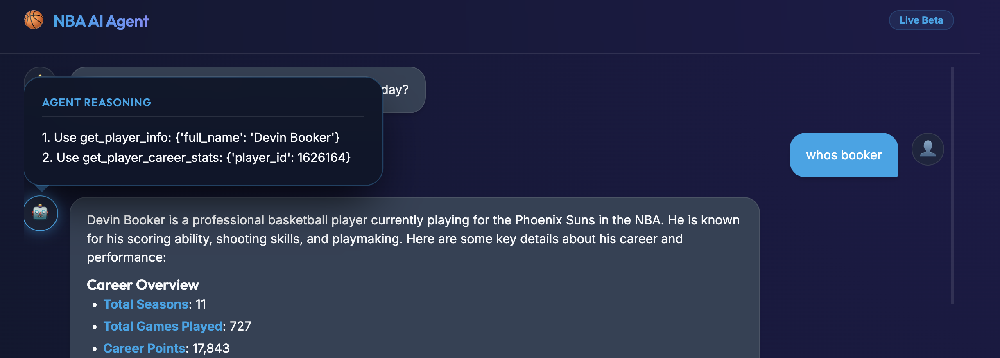
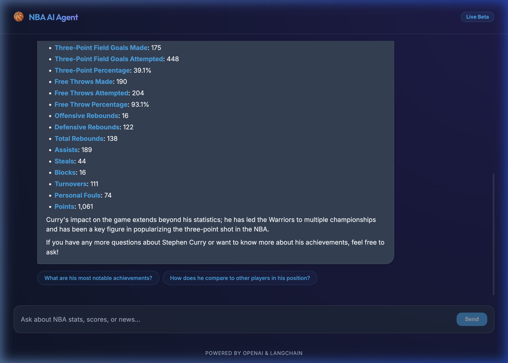
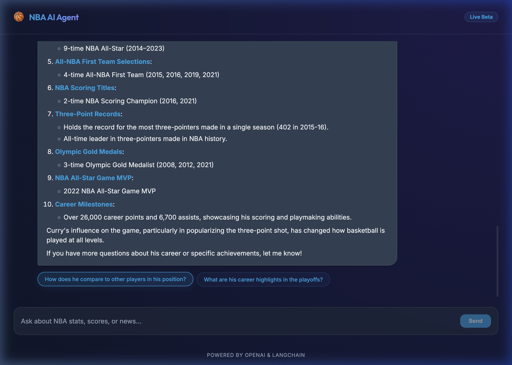
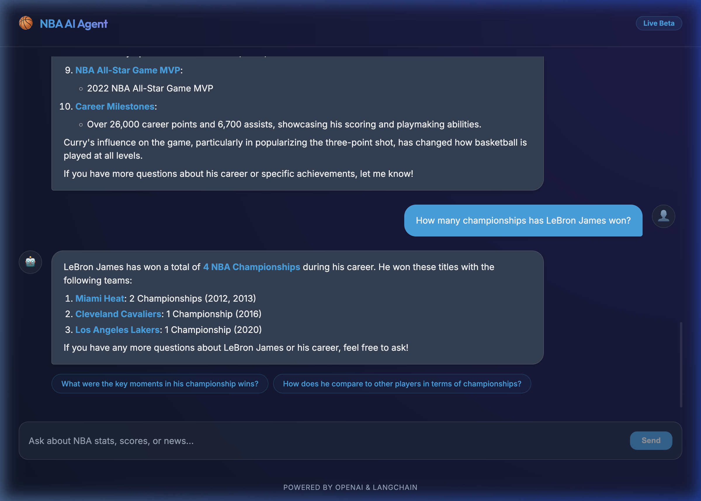

# NBA Agent

> **TL;DR** — A conversational AI agent for NBA fans. Ask about any player or team, get real-time stats and news with clickable follow-up questions. Built with LangChain + FastAPI + React. Run it with a single command: `bash start.sh`.

---

## What's Cool About This Project

- 🧠 **Chain-of-Thought Reasoning** — Before every answer, the agent uses a `think` tool to reason step-by-step. Hover over the 🤖 icon to see its internal reasoning.
- 🏀 **Real NBA Data** — Pulls live player/team stats from the official NBA API, no fake data.
- 🔍 **Web Search** — Searches the web via Tavily for current scores, trades, and breaking news.
- 💬 **Session Memory** — The agent remembers context within a conversation (powered by `RunnableWithMessageHistory`).
- 🎯 **Follow-up Pills** — Every response ends with 2 clickable follow-up questions, making exploration frictionless.
- 🔒 **Anti-Hallucination** — System prompt strictly enforces tool-only responses; the LLM cannot use internal knowledge for stats.
- 🧪 **Unit Tests** — Tool functions are fully covered with mocked NBA API calls (`pytest tests/`).

---

## Screenshots

**Agent reasoning tooltip** — hover the 🤖 avatar to see which tools were called and why:



**Real career stats with follow-up pills:**



**Clicking a follow-up sends the question and generates a new response:**



**Multi-turn session memory — LeBron championships:**



---

## Architecture

The project follows a modular architecture designed for scalability and maintainability:
- **FastAPI Backend**: Provides a robust REST API to handle chat messages and session management.
- **LangChain Agent**: An OpenAI Tools-based agent that leverages a "Chain of Thought" reasoning process.
- **Session Management**: Uses `RunnableWithMessageHistory` to manage isolated chat contexts for different users/sessions.
- **Design Pattern**: Decoupled tool definitions, prompt management, and service orchestration.

## Code Structure

- `main.py`: FastAPI server, request validation, and API response formatting.
- `agent_service.py`: Orchestrates the LangChain agent, LLM configuration, and session history logic.
- `tools.py`: Definition of all tools available to the agent (NBA API wrappers, web search).
- `config.py`: Centralized configuration management using Pydantic Settings.
- `prompts.py`: Central repository for all system prompts and documentation strings.
- `utils.py`: Common helpers for JSON formatting, error handling, and tool decorators.
- `tests/`: Unit tests for tools and utilities (no network calls required).

## Tools

1. **think**: Allows the agent to record and display its internal reasoning steps before responding.
2. **get_player_info**: Retrieves IDs and basic details for NBA players.
3. **get_team_info**: Fetches core data for NBA teams.
4. **get_player_career_stats**: Provides summarized career statistics (points, assists, rebounds, etc.).
5. **web_search**: Powered by Tavily, enabling the agent to access current NBA news and real-time events.

## How to Run

### 1. Prerequisites
- Python 3.10 or higher.
- Node.js 18+ for the frontend.

### 2. Setup
1. **Install dependencies**:
   ```bash
   poetry install       # Python backend
   cd frontend && npm install  # React frontend
   ```
2. **Configure Environment**:
   Create a `.env` file in the root directory with **only your API keys**:
   ```env
   OPENROUTER_API_KEY=your_openrouter_key
   TAVILY_API_KEY=your_tavily_key
   ```

   | Key | Required | Where to get it |
   |-----|----------|-----------------|
   | `OPENROUTER_API_KEY` | ✅ Yes | [openrouter.ai/keys](https://openrouter.ai/keys) — Free tier available |
   | `TAVILY_API_KEY` | ⚠️ Optional | [app.tavily.com](https://app.tavily.com) — Needed for `web_search` tool only |

   > All other settings (API base URL, model name) are pre-configured defaults in `config.py`.

### 3. Execution

- **Recommended: Start Both with One Command**:
  ```bash
  bash start.sh
  ```
  This handles starting the FastAPI backend (port 8000) and the Vite frontend (port 5173) in parallel.

- **Manual Start**:
  - Backend: `poetry run uvicorn main:app --reload --port 8000`
  - Frontend: `cd frontend && npm run dev`

### 4. Running Tests
```bash
pytest tests/ -v   # All unit tests (no server or API keys needed)
```

### 6. Deploying to Vercel

This project is configured for easy deployment to Vercel:

1.  **Push to GitHub**: Ensure all changes are committed and pushed.
2.  **Import to Vercel**: Connect your repository to Vercel.
3.  **Environment Variables**: In the Vercel dashboard, add the following environment variables:
    - `OPENROUTER_API_KEY`
    - `TAVILY_API_KEY` (optional)
4.  **Automatic Build**: Vercel will automatically detect the `vercel.json` configuration and build both the FastAPI backend and React frontend.

The backend is served from the `/api` route, and the frontend is served from the root.

## Future Enhancements
- **Persistent Storage**: Migration from in-memory session history to a database (Redis or PostgreSQL).
- **Proactive Insights**: Adding a scheduling layer to alert users of upcoming games or trades.
- **Rich UI Components**: Supporting player headshots and team logos in the chat interface.
- **Comparison Engine**: A specialized tool for head-to-head statistical player comparisons.
- **E2E Testing with Return-Direct flag**: Test the returned tool data directly, bypassing LLM rephrasing.
